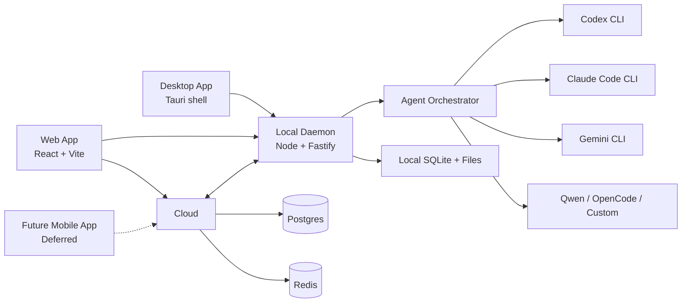

# OfferU Technical Architecture Design

Date: 2026-06-05

## 1. Product Purpose

OfferU is an AI job-search operating system and multi-agent work platform.

The first product scenario is job search: career asset management, job matching, tailored resume generation, application tracking, interview preparation and outcome learning. The underlying architecture is designed as an agent orchestration platform so the same system can later support multiple users, SaaS delivery, mobile approvals and external algorithm/API services.

The product is personal-first and SaaS-ready:

- Phase 1: serve the founder's own job search with a local-first system.
- Phase 2: support multiple users through cloud sync and managed product workflows.
- Phase 3: expose algorithm services for JD parsing, resume matching, candidate profiling, recommendation and agent workflow execution.

## 2. Confirmed Decisions

| Decision | Choice |
| --- | --- |
| Initial market | Personal use first, future multi-user SaaS |
| Product positioning | Job-search product and agent platform both matter; first version focuses on job search |
| Data strategy | Resume, JD and reports may sync to cloud; source code and shell execution stay local |
| Execution strategy | Desktop/local daemon runs AI CLIs, Git, filesystem and shell commands |
| Mobile role | Mobile app is a remote control and approval console, not an execution runtime |

## 3. Architecture Principles

1. Local execution first: AI CLIs, source code access, shell commands and Git operations run on the user's machine.
2. SaaS-ready data model: user, workspace, task, resume, JD, report and event models are multi-tenant from the start.
3. Provider abstraction: Codex, Claude Code, Gemini CLI, Qwen, OpenCode and future agents are adapters behind a common interface.
4. Human approval by default: high-risk actions require explicit user approval or a saved policy.
5. Source-code privacy: the cloud sync layer must not require uploading local repositories.
6. Observable workflows: every task produces structured events, logs, approvals, diffs and status transitions.
7. Incremental migration: current Career-Ops files remain usable while the new app is introduced.

## 4. Target System Overview



## 5. Recommended Technology Stack

### Web App

- Framework: React + TypeScript + Vite
- Styling: Tailwind CSS + shadcn/ui
- State: Zustand for local UI state
- Server state: TanStack Query
- Terminal view: xterm.js
- API contracts: shared Zod schemas from `packages/shared`

### Desktop App

- Preferred: Tauri + TypeScript
- Fallback: Electron if terminal embedding or process control becomes too constrained
- Purpose: host the local daemon, manage local projects, expose a native shell, and pair with cloud

### Local Daemon

- Runtime: Node.js + TypeScript
- API: Fastify
- Realtime: WebSocket for terminal/session events
- CLI/TUI process control: node-pty
- Local DB: SQLite + Drizzle
- Validation: Zod
- Git: simple-git plus shell fallback
- Storage: local workspace files, `data/`, `resumes/`, `reports/`, `output/`

### Cloud API

- Runtime: Node.js + TypeScript
- Framework: Fastify for consistency, or NestJS if team size grows
- DB: Postgres
- Cache/queue: Redis
- Realtime: WebSocket
- Auth: Clerk for early SaaS, with an option to migrate to custom JWT later
- Notifications: APNs + FCM
- Billing, later: Stripe

### Mobile App

- Framework: React Native + Expo + TypeScript
- Role: task inbox, approval, notifications, task status, diff/report review
- No direct shell execution
- Current batch: mobile is explicitly out of scope.

## 6. Monorepo Layout

```text
apps/
  web/                 # React + Vite web console
  desktop/             # Tauri desktop shell
  daemon/              # Local Node/Fastify daemon
  api/                 # Cloud API

packages/
  shared/              # Zod schemas, DTOs, shared types
  agent-core/          # Tasks, sessions, events, approvals, permissions
  provider-codex/      # Codex CLI adapter
  provider-claude/     # Claude Code adapter
  provider-gemini/     # Gemini CLI adapter
  provider-qwen/       # Qwen adapter
  provider-opencode/   # OpenCode adapter
  job-core/            # JD parsing, matching, resume/report domain logic
  ui/                  # Shared UI components, optional

data/                  # Existing local user data remains supported
resumes/
reports/
output/
```

## 7. Core Product Modules

### 7.1 Career Asset Library

Manages the user's career proof:

- Base CV
- Experience assets
- STAR stories
- Project proof points
- Articles and case studies
- Skills, domains, industries and target role preferences

Current sources such as `cv.md`, `article-digest.md`, `config/profile.yml`, `data/experience-profile.json` and `resumes/` remain valid during migration.

Current migration status:

- `apps/daemon/src/profile-store.ts` exposes a profile overview from `cv.md`, `config/profile.yml` and `modes/_profile.md`.
- `apps/web/src/sections/ProfileSection.tsx` shows candidate identity, target roles, CV source and profile overlay.
- The current parser intentionally avoids adding a YAML dependency; later algorithm services should move this to a stricter schema parser.

### 7.2 Job Market and JD Intelligence

Responsibilities:

- Import JD from URL, browser extension, pasted text or manual entry
- Parse title, company, location, seniority, compensation, requirements and responsibilities
- Detect legitimacy and liveness
- Cluster jobs by role family and opportunity type
- Keep deduplicated job records

### 7.3 Matching and Scoring

Responsibilities:

- Score job fit against user profile
- Explain score with evidence
- Identify gaps and mitigation strategies
- Recommend apply, skip, watch or research more
- Feed user feedback back into the profile layer

### 7.4 Resume Generation

Responsibilities:

- Generate tailored resume variants
- Preserve source evidence for each edit
- Export PDF/DOCX/Markdown
- Maintain resume version history
- Link resume versions to jobs and outcomes

Current migration status:

- `apps/daemon/src/resume-store.ts` exposes resume listing, resume read, local preview generation and explicit Markdown save APIs.
- `apps/daemon/src/resume-export-store.ts` exports resume Markdown, HTML, PDF and DOCX into `output/exports/`.
- `apps/web/src/sections/ResumeSection.tsx` lets the user select a base resume and market job, preview a generated variant and save it locally.
- Generated resume saves update `data/resume-job-links.json` so resume variants can be connected to market jobs, application outcomes and later cloud sync records.
- The current generator is deterministic and local-only; AI provider-backed rewriting should be added behind the approval/task system rather than writing files directly.

### 7.5 Application Tracker

Responsibilities:

- Track status, deadlines, follow-ups, interview stages and outcomes
- Preserve canonical states
- Prevent duplicate company/role entries
- Provide conversion analytics by source, score and role family

### 7.5.1 Evaluation Report Library

Responsibilities:

- List evaluation reports from `reports/`.
- Parse report headers such as date, URL, score, recommendation and legitimacy.
- Provide Markdown report details for web, mobile and future cloud sync.
- Keep report storage file-compatible during migration.

Current migration status:

- `apps/daemon/src/report-store.ts` exposes report overview and single-report read APIs.
- `apps/web/src/sections/ReportsSection.tsx` adds a report center with metrics and Markdown preview.

### 7.6 Agent Workspace

Responsibilities:

- Run Codex, Claude Code, Gemini CLI and other providers
- Display terminal sessions
- Manage task queue, approvals and diffs
- Record all events in a provider-neutral format
- Allow job-search workflows to call agents without hardcoding one provider

Current migration status:

- Provider adapters for Codex, Claude and Gemini expose install checks and structured command creation.
- `apps/daemon/src/runner.ts` runs approved structured provider tasks and approval-gated local commands with `spawn`.
- Web Agent Console can create provider tasks, create local command approvals, approve/deny actions and inspect task events.
- `POST /api/sync/push-to-cloud` pushes the local SQLite outbox to the cloud API and marks accepted events pushed. The default local cloud port is `4191` because `4190` is blocked by the Fetch bad-port list.

## 8. Agent Orchestrator Design

The orchestrator owns tasks and sessions. Providers only implement execution details.

```ts
export interface AgentProvider {
  id: string;
  label: string;
  capabilities: AgentCapabilities;

  checkInstalled(): Promise<InstallStatus>;
  startSession(input: AgentSessionInput): Promise<AgentSessionHandle>;
  sendMessage(sessionId: string, message: string): Promise<void>;
  stopSession(sessionId: string): Promise<void>;
}
```

Provider examples:

- `provider-codex`: supports Codex CLI execution, approval mode mapping, headless execution where available
- `provider-claude`: supports `claude -p`, stream JSON output, session resume and MCP configuration
- `provider-gemini`: supports Gemini CLI prompt execution and terminal sessions
- `provider-opencode`: supports OpenCode agent execution

The orchestrator supports two execution modes:

| Mode | Use case | Implementation |
| --- | --- | --- |
| Structured runner | Automation, background tasks, parseable logs | CLI print/headless mode, JSON or line protocol |
| PTY runner | Interactive TUI sessions | node-pty + xterm.js |

## 9. Unified Event Model

All providers emit normalized events:

```ts
export type AgentEvent =
  | { type: "message"; role: "user" | "assistant" | "system"; text: string }
  | { type: "command"; command: string; cwd: string; status: "requested" | "running" | "done" | "failed" }
  | { type: "file_change"; path: string; diff?: string; summary?: string }
  | { type: "approval_request"; approvalId: string; action: PermissionAction; risk: RiskLevel }
  | { type: "task_status"; taskId: string; status: TaskStatus }
  | { type: "error"; message: string; provider?: string };
```

This keeps the UI independent from the provider.

## 10. Permission and Approval Model

Unified permissions:

```text
read_files
write_files
delete_files
run_shell
install_package
network_access
git_commit
git_push
open_browser
send_application
sync_cloud
```

Default rules:

- Read-only actions can run automatically inside approved workspace paths.
- File writes require approval unless the task policy explicitly allows them.
- Shell commands require approval unless matched by a safe allowlist.
- Package installation, delete, push and application submit are high-risk actions.
- The system must never submit a job application without final user approval.

Approval choices:

- Allow once
- Allow for this task
- Allow for this workspace
- Deny
- Edit command/input

## 11. Data Strategy

Confirmed strategy: resume, JD and reports may sync to cloud; source code and shell access stay local.

### Local-only Data

- Source repositories
- Shell history and raw environment variables
- AI CLI credentials
- Local agent sessions that include code context
- Unredacted command output from private projects

### Cloud-sync Data

- User profile
- Resume documents and versions
- JD records
- Evaluation reports
- Application tracker
- Task metadata
- Approval records
- High-level agent summaries

### Optional Cloud Data

- Diffs or file snippets, only when explicitly approved
- Interview preparation notes
- Career assets and proof points

## 12. Data Model Draft

Core SaaS entities:

```text
users
organizations
workspaces
devices
device_pairings
career_profiles
career_assets
jobs
job_evaluations
resume_versions
applications
follow_ups
agent_tasks
agent_sessions
agent_events
approval_requests
provider_configs
sync_events
audit_logs
```

Local daemon entities:

```text
local_workspaces
local_projects
local_provider_configs
local_agent_sessions
local_agent_events
local_approvals
local_sync_cursor
```

## 13. API Design

### Local Daemon API

```text
GET    /health
GET    /workspaces
POST   /workspaces
GET    /providers
POST   /providers/:id/check
POST   /agent-tasks
GET    /agent-tasks/:id
POST   /agent-tasks/:id/cancel
GET    /agent-tasks/:id/events
POST   /agent-sessions/:id/message
POST   /approvals/:id/decision
GET    /resumes
POST   /resumes/generate
GET    /jobs
POST   /jobs/import
POST   /jobs/:id/evaluate
```

### Cloud API

```text
POST   /auth/device-pairing
POST   /devices/:id/heartbeat
GET    /sync/pull
POST   /sync/push
GET    /tasks
POST   /tasks
GET    /tasks/:id/events
POST   /approvals/:id/decision
GET    /jobs
POST   /jobs
GET    /resumes
POST   /resumes
GET    /applications
POST   /applications
```

## 14. Mobile and Desktop Pairing

Pairing flow:

1. Desktop app starts local daemon and signs into cloud.
2. Desktop shows a short pairing code.
3. Mobile app signs in and submits the code.
4. Cloud links the mobile device to the user's desktop device.
5. Desktop daemon maintains a WebSocket connection to the cloud.
6. Mobile sends task commands and approval decisions through cloud.
7. Desktop daemon executes local actions and streams events back.

Security requirements:

- Pairing codes expire quickly.
- Device tokens can be revoked.
- High-risk approvals include command, cwd, affected files and risk level.
- The cloud cannot directly execute shell commands.

## 15. Algorithm Services

Internal algorithm modules should be written as pure services first, then exposed as APIs later.

Initial services:

- JD parser
- JD legitimacy classifier
- Role family classifier
- Candidate profile extractor
- Resume-to-JD matching scorer
- Resume rewrite planner
- Evidence retrieval and proof-point matcher
- Application outcome analyzer
- Job recommendation ranker

API product candidates:

```text
POST /algorithms/jd/parse
POST /algorithms/match/score
POST /algorithms/resume/rewrite-plan
POST /algorithms/candidate/profile
POST /algorithms/jobs/rank
```

## 16. Deployment Model

### Phase 1: Personal Local

- Run `apps/daemon` locally.
- Run `apps/web` locally.
- Keep existing Career-Ops files as the storage source.
- No required cloud dependency.

### Phase 2: Desktop + Cloud Sync

- Desktop app bundles or starts daemon.
- Cloud stores user profile, JD, resume, reports and tracker data.
- Mobile can view tasks and approve actions.

### Phase 3: SaaS

- Cloud API serves multiple users and organizations.
- Postgres and Redis become required.
- Billing, team workspaces, audit logs and managed algorithm services are added.

## 17. Migration Plan From Current Project

### Step 1: Introduce Monorepo Boundaries

- Create `apps/web`, `apps/daemon`, `packages/shared`.
- Keep current `visualizer/` working during migration.
- Move only new code first; do not rewrite all existing modules at once.

### Step 2: Migrate Frontend

- Rebuild `visualizer/index.html` and browser JS into React screens.
- Preserve current views: experience assets, job market, resume library, application import, evidence review.
- Add typed API client from `packages/shared`.

### Step 3: Migrate Backend

- Convert `resume-visualizer.mjs` and `visualizer/services/*.mjs` into `apps/daemon`.
- Keep current file read/write behavior.
- Add API response shape: `{ ok, data, error }`.

### Step 4: Add Local SQLite

- Store sessions, task events, approvals and sync cursors in SQLite.
- Keep career artifacts in files until the migration value is clear.

### Step 5: Add Provider Adapters

- Implement Codex provider first.
- Implement Claude provider second.
- Add PTY terminal UI after structured runner works.

### Step 6: Add Cloud Sync

- Add cloud API with user, device, workspace, task and approval models.
- Sync only safe data by default.
- Add explicit controls for optional diff/snippet sync.

### Step 7: Add Mobile

- Build task inbox, approval detail, task event stream and notifications.
- Avoid implementing local execution in mobile.
- Current batch: deferred by product decision.

## 18. MVP Scope

MVP should not try to solve the entire SaaS future.

MVP includes:

- React web console
- Local daemon
- Resume/JD/report/tracker workflows
- One structured provider adapter, preferably Codex
- One interactive PTY provider session
- SQLite task/event/approval storage
- Manual cloud design; mobile implementation is deferred

MVP excludes:

- Team billing
- Full cloud execution
- Automatic application submission
- Uploading source repositories
- Complex CRM features

## 19. Acceptance Criteria

The first architecture milestone is accepted when:

1. Existing visualizer workflows still work or have equivalent React screens.
2. A user can create an agent task from the web UI.
3. The local daemon can run at least one provider through the common interface.
4. Task events stream to the UI.
5. File writes and shell commands produce approval requests.
6. Resume/JD/report records remain linkable to current file storage.
7. The design keeps source code and shell permissions local.

## 20. Initial Implementation State

The first architecture slice has been introduced without removing the legacy visualizer:

- `apps/daemon`: new local execution boundary. The current implementation starts `src/legacy-visualizer.mjs`, which reuses existing `visualizer/services/*.mjs`.
- `apps/daemon/src/server.ts`: TypeScript Fastify API entry for platform capabilities such as provider inspection.
- `.offeru/daemon.sqlite`: local SQLite fact source for daemon tasks, events, approval requests and approval decisions.
- `sync_events`: local SQLite outbox for future cloud sync; daemon exposes outbox read and mark-pushed APIs.
- `apps/web`: new React/Vite/TypeScript web surface. The current screen is a product-architecture shell; visualizer screens should migrate here incrementally.
- `packages/shared`: shared DTOs and provider-neutral event contracts.
- `packages/agent-core`: provider interface, session contracts and approval policy abstractions.
- `packages/provider-codex`: first provider adapter; currently checks Codex CLI installation and exposes provider capabilities.
- `packages/provider-claude` and `packages/provider-gemini`: additional provider adapters with installation checks and capability metadata.
- `apps/daemon/src/runner.ts`: structured runner that starts provider CLIs only after an approval decision allows execution.
- `apps/web`: now includes provider inspection, task creation, approval decisions and a task event timeline.
- Resume migration has started: `apps/daemon/src/resume-store.ts` exposes typed resume list/read APIs, and `apps/web` renders the resume library from the new daemon API.
- Recruitment market migration has started: `apps/daemon/src/market-store.ts` reads sharded market jobs and `apps/web` renders the first job-list panel from the new daemon API.
- Applications migration has started: `apps/daemon/src/application-store.ts` parses `data/applications.md` and `apps/web` renders application metrics and tracker rows.
- Experience assets migration has started: `apps/daemon/src/experience-store.ts` reads `mycv/project-notes` and `data/experience-metadata.json`, and `apps/web` renders experience cards.
- Evidence center migration has started: `apps/daemon/src/evidence-store.ts` reads `data/evidence-requests.json`, and `apps/web` renders evidence request cards.
- Evidence fulfillment writes have started: `apps/daemon/src/evidence-store.ts` validates request IDs and target paths, then appends submitted evidence to safe `mycv/project-notes/*` targets from the web console.
- Experience metadata writes have started: `apps/daemon/src/experience-store.ts` validates and saves structured metadata to `data/experience-metadata.json`, and `ExperienceSection` can edit summaries/evidence.
- Web section refactor completed: business panels are split into `apps/web/src/sections`, while `App.tsx` owns data loading, navigation and cross-section handlers.
- Application event writes have started: `apps/daemon/src/application-store.ts` appends validated progress events to `data/application-events.jsonl`, merges events into application summaries, and `ApplicationsSection` can save new events.
- Application event CRUD has started: new daemon routes update/delete progress events, and `ApplicationsSection` exposes latest-event edit/delete actions.
- `apps/api`: cloud sync/API skeleton for device pairing, sync pull/push and approval relay.
- `apps/desktop`: package boundary for the future Tauri desktop shell.
- `docs/OFFERU_ARCHITECTURE_TASKS.md`: workstream split for web, daemon, shared contracts, provider adapters, data migration and cloud sync. Mobile is documented as deferred.

Current commands:

```bash
npm run daemon
npm run daemon:api
npm run api
npm run web
npm run web:build
npm run typecheck
```
