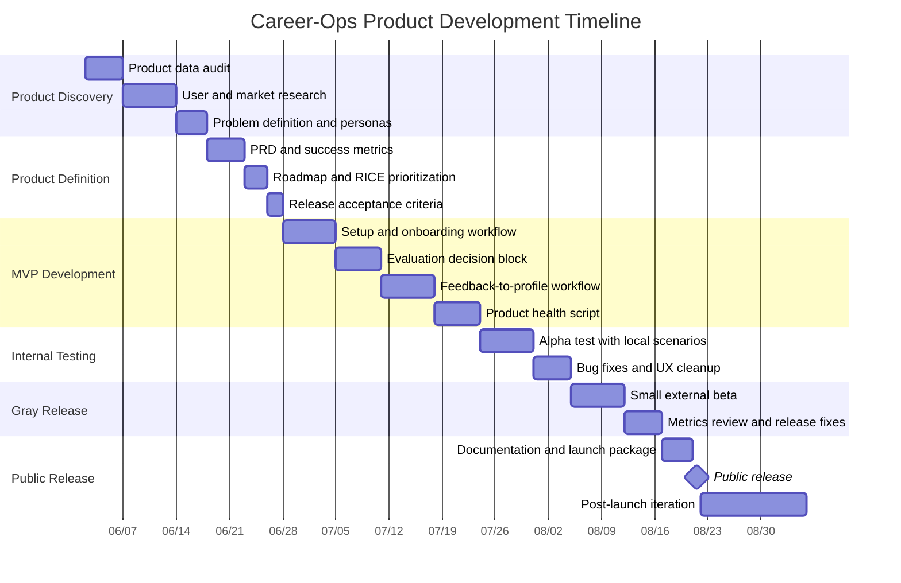

# Career-Ops Product Development Timeline

Date: 2026-06-02

This timeline treats career-ops as a product under active development. The recommended release cycle is 12 weeks: discovery, product definition, MVP development, alpha testing, beta/gray release, public release and post-launch iteration.

## Timeline Overview

## Phase Plan

| Phase | Time | Goal | Main Work | Deliverables | Exit Criteria |
|-------|------|------|-----------|--------------|---------------|
| 0. Product data audit | Week 1 | Understand current product state | Review existing scripts, docs, reports, tracker, scanner, dashboard and user-layer/system-layer boundaries | Current-state audit, module map, risk list | Known product modules and top workflow gaps are documented |
| 1. User and market research | Week 1-2 | Validate who the product is for and what pain matters most | Interview target users, review competing workflows, collect failed setup/evaluation cases, study open-source job-search tooling | Research notes, personas, top user pains | ICP, top 5 problems and must-not-do constraints are clear |
| 2. Product definition | Week 3 | Turn research into product requirements | Finalize PRD, MVP scope, metrics, roadmap, RICE priority, acceptance criteria | PRD, roadmap, metric tree, prioritized backlog | Team can say what v1 is, what it is not, and how success is measured |
| 3. MVP development | Week 4-7 | Build the smallest reliable product workflow | Setup checklist, guided evaluation output, feedback-to-profile workflow, product-health script, report quality template | Working MVP features and tests | A user can complete setup, evaluate a job, generate output, track it and provide feedback |
| 4. Internal alpha | Week 8 | Test with controlled local scenarios | Run scripted test cases, evaluate sample JDs, verify PDF/report/tracker flow, check edge cases | Alpha test report, bug list, fixed blockers | No blocker in setup, evaluation, PDF generation, merge tracker or liveness check |
| 5. Gray beta | Week 9-10 | Test with a small real-user group | Invite 3-5 users, collect setup friction, report usefulness, scanner precision and feedback-loop quality | Beta findings, metric snapshot, revised backlog | At least 80% of beta users complete first successful evaluation without maintainer intervention |
| 6. Release preparation | Week 11 | Package the product for public use | Update README, setup docs, product docs, release notes, examples, screenshots and compatibility checks | Release candidate, changelog, docs, demo assets | `npm test` / `node test-all.mjs` passes and docs match current workflow |
| 7. Public release | Week 12 | Publish v1 product release | Tag release, publish announcement, open feedback channels, monitor issues | v1 release, issue triage board | Release is public, installable and has a visible support path |
| 8. Post-launch iteration | Week 13-14 | Learn from real usage | Analyze issues, conversion metrics, failed setups, scanner precision and report quality; plan next cycle | Post-launch review, v1.1 backlog | Top regressions are fixed or prioritized |

## Detailed Work By Phase

### 0. Product Data Audit

Purpose: establish the baseline before building.

Work:

- Map current modules: scanner, evaluator, PDF generator, tracker, dashboard, update system, liveness checker.
- Review file boundaries: user layer vs system layer.
- Check current reports and tracker integrity.
- Identify which workflows are reliable, fragile or undocumented.

Output:

- Product module map.
- Gap list.
- Risk list.
- Initial metric baseline.

### 1. Product Data And User Research

Purpose: avoid building features from assumptions.

Detailed recruiting channels, interview questions and personas are defined in `docs/USER_RESEARCH.md`.
For concrete outreach scripts and the first-week recruiting plan, see `docs/USER_OUTREACH_PLAYBOOK.md`.

Research questions:

- Who gets the most value from career-ops today?
- Where do users fail during setup?
- Which report sections actually help application decisions?
- How often are scanner results relevant?
- What feedback should the system learn from?
- What would make the dashboard worth using daily?

Suggested data sources:

- Existing reports in `reports/`.
- Tracker rows in `data/applications.md`.
- Pipeline URLs in `data/pipeline.md`.
- Scan history in `data/scan-history.tsv`.
- GitHub issues, discussions and user feedback.
- Manual interviews with 3-5 target users.

Output:

- Personas.
- Top pains.
- Product opportunity list.
- Baseline metrics.

### 2. Product Definition

Purpose: convert research into a clear build target.

Work:

- Write or update PRD.
- Define MVP and non-goals.
- Define North Star and supporting metrics.
- Prioritize backlog with RICE.
- Write acceptance criteria for each release feature.
- Decide whether Graduate Mode remains a later validated sub-mode or enters the v1 scope.

Output:

- `docs/PRODUCT.md`
- `docs/PRODUCT_TIMELINE.md`
- v1 backlog
- acceptance criteria

### 3. MVP Development

Purpose: make the core workflow complete and testable.

Recommended MVP feature order:

1. Setup and onboarding checklist.
2. Evaluation decision block.
3. Feedback-to-profile workflow.
4. Product health script.
5. Dashboard or report improvements only after the workflow is stable.

Acceptance criteria:

- Setup can be validated with one command.
- Evaluation report gives a clear decision: apply, skip, watch or research more.
- Feedback updates only user-layer personalization files.
- Tracker additions still follow the TSV merge contract.
- Liveness checks do not silently trust stale web results.

### 4. Internal Alpha

Purpose: test before exposing to real users.

Test scenarios:

- Fresh setup with missing files.
- High-fit job URL.
- Low-fit job URL.
- Closed or stale job URL.
- Duplicate company + role.
- PDF generation failure.
- User feedback: "score too high" and "you missed my experience."

Output:

- Alpha test report.
- Blocker list.
- Fixed regressions.

### 5. Gray Beta

Purpose: release to a small group before public launch.

Beta group:

- 3-5 real users.
- At least one technical job seeker.
- At least one career switcher.
- At least one user unfamiliar with the repository.

Measure:

- Setup completion rate.
- First evaluation success rate.
- Time from URL to decision.
- Report usefulness rating.
- Scanner relevance.
- Number of maintainer interventions.

Exit criteria:

- 80%+ first evaluation success without maintainer intervention.
- No critical data-loss or tracker-integrity issue.
- Users understand that the product discourages low-fit applications.

### 6. Release Preparation

Purpose: make v1 understandable and supportable.

Work:

- Update README and setup docs.
- Add screenshots or GIFs if needed.
- Confirm install steps.
- Run test suite.
- Write release notes.
- Prepare known issues and support path.

Output:

- Release candidate.
- Changelog.
- Public docs.

### 7. Public Release

Purpose: ship the product and start collecting real feedback.

Work:

- Tag release.
- Publish release notes.
- Announce in selected channels.
- Monitor issues.
- Triage feedback daily during the first week.

Success criteria:

- Users can install and run the first workflow.
- Product docs explain the core use case without maintainer help.
- Issues are categorized by setup, evaluation, scanner, PDF, tracker, dashboard or docs.

### 8. Post-Launch Iteration

Purpose: feed real usage into the next roadmap.

Work:

- Review support issues.
- Compare metrics to baseline.
- Identify repeated failure patterns.
- Re-score backlog.
- Plan v1.1.

Output:

- Post-launch review.
- v1.1 priority list.
- Updated product docs.

## Release Gates

| Gate | Required Before Moving On |
|------|---------------------------|
| Discovery complete | Personas, top pains and current workflow gaps are documented |
| PRD approved | MVP, non-goals, metrics and acceptance criteria are clear |
| MVP complete | Core URL-to-decision-to-tracker workflow works locally |
| Alpha pass | No blocker in setup, evaluation, PDF, tracker merge or liveness |
| Beta pass | 80%+ users complete first evaluation without maintainer help |
| Release candidate | Tests pass, docs are updated, known issues are documented |
| Public release | Support path, issue triage and post-launch review are ready |

## Suggested Calendar

| Week | Stage | Focus |
|------|-------|-------|
| Week 1 | Audit + discovery | Current-state audit, user research plan, product data baseline |
| Week 2 | Research | User interviews, market/workflow comparison, problem ranking |
| Week 3 | Definition | PRD, MVP scope, metrics, RICE, acceptance criteria |
| Week 4 | Development | Setup/onboarding workflow |
| Week 5 | Development | Evaluation decision block and report quality template |
| Week 6 | Development | Feedback-to-profile workflow |
| Week 7 | Development | Product health script and workflow polish |
| Week 8 | Internal alpha | Scenario testing and blocker fixes |
| Week 9 | Gray beta | 3-5 user beta and metric collection |
| Week 10 | Gray beta | Fix beta issues and tighten docs |
| Week 11 | Release prep | Release candidate, changelog, examples, compatibility checks |
| Week 12 | Public release | Publish v1, monitor issues, start post-launch review |
| Week 13-14 | Iteration | Metrics review, v1.1 planning and quick fixes |

## First Implementation Slice

The smallest useful development slice is:

1. Add setup checklist to `docs/SETUP.md`.
2. Add evaluation decision block to `modes/oferta.md`.
3. Add feedback-to-profile workflow documentation.
4. Add `product-health.mjs` to summarize setup, pipeline, tracker, reports and scanner health.
5. Test with 3 representative job URLs.

This slice should be completed before starting dashboard-heavy work.

## Optional Graduate Mode Slice

Only start this slice after interviewing at least 5 fresh graduates.

1. Collect 20 real campus-recruiting JDs.
2. Collect 5 anonymized student resumes or project profiles.
3. Draft `modes/graduate.md`.
4. Draft `templates/graduate-tracker.md`.
5. Test whether fresh-graduate scoring and experience asset extraction changes application decisions.
