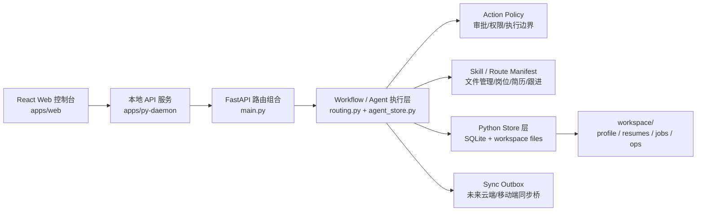

# Architecture

> 架构治理规范请优先参考：[docs/architecture/governance.md](governance.md)。

## System Overview



`docs/archive/legacy-typescript-daemon` is retained only as the legacy TypeScript reference and adapter
boundary. New backend API work lands in `apps/py-daemon` first.

## Runtime Flow

1. **Input**: Web 对话框接收文本、URL 和附件。
2. **Parse**: 附件解析服务把 PDF/DOCX/图片/文本归档到 `workspace/ops/imports/agent-attachments/{date}/...`。
3. **Route**: Python daemon 根据输入、附件摘要和当前上下文选择 workflow/skill。
4. **Run**: workflow run 记录步骤状态、审批点、追问点和产物。
5. **Policy**: 高风险动作进入 approval queue，用户确认后继续执行。
6. **Persist**: 所有业务产物写入 `workspace/` 四类目录。
7. **Sync Ready**: workflow/task/event/outbox 保留未来同步到云端和移动端的协议边界。

## Workspace Boundary

```text
workspace/
  profile/   # CV, profile.yml, portals.yml, headshots, writing samples, intentions
  resumes/   # resume library, source files, rendered files and quicklook previews
  jobs/      # JDs, evaluation reports, research, interview prep, project notes, examples
  ops/       # app data, templates, imports, exports and batch-processing state
```

Root-level source directories are product implementation files. Job-search assets should not return to root-level `data/`, `reports/`, `jds/`, `resumes/`, `templates/`, `output/`, `batch/` or `dashboard/`.

## Pipeline Integrity

| Script | Purpose |
|--------|---------|
| `npm run merge` | Merges `workspace/ops/batch/tracker-additions/*.tsv` into `workspace/ops/data/applications.md` |
| `npm run verify` | Health check: statuses, duplicates, links |
| `npm run dedup` | Removes duplicate entries by company+role |
| `npm run normalize` | Maps status aliases to canonical values |
| `npm run sync-check` | Validates setup consistency |

## Validation

```bash
npm run typecheck
npm run web:build
node scripts/architecture-guard.mjs
npm run verify
npm run doctor
```
