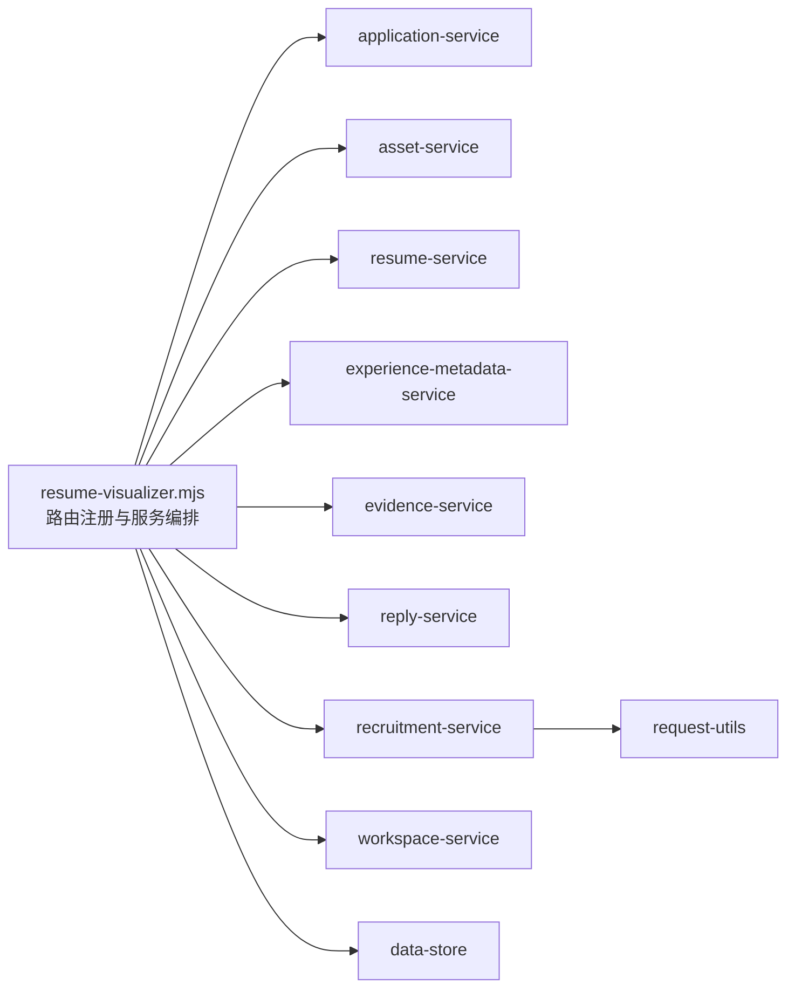

# 网站治理指引（Resume Visualizer）

本文件用于把 `career-ops` 中的可视化网站后端拆分和变更节奏固定下来，避免再次形成大文件耦合。

## 一、治理目标

1. 主入口只做路由编排，不承载业务实现。
2. 后端服务按域拆分（简历、应用、资产、岗位市场、回复、工作区）。
3. 数据读写边界清晰：共享 `data-store` 统一文件读写，路由层不做重复路径判断逻辑。
4. 任何前后端改动都要有最小验证清单。

## 二、当前拆分边界（已落地）

- `resume-visualizer.mjs`：只保留通用路由调度、文件托管、错误与静态资源处理。
- `visualizer/services/application-service.mjs`：应用进度事件与查询。
- `visualizer/services/asset-service.mjs`：经验文件、头像、模板导入与列表。
- `visualizer/services/resume-service.mjs`：简历读取、自动生成、版本管理、行级编辑、导出。
- `visualizer/services/experience-metadata-service.mjs`：经历元数据读写与历史记录。
- `visualizer/services/evidence-service.mjs`：补充证据请求读取。
- `visualizer/services/reply-service.mjs`：回复草稿生成与状态更新。
- `visualizer/services/recruitment-service.mjs`：岗位市场列表、搜索与爬虫触发。
- `visualizer/services/workspace-service.mjs`：工作区资源读写、路径校验、glob 列表。
- `visualizer/services/render-service.mjs`：PDF/DOCX 导出及 DOCX XML 拼装。
- `visualizer/services/request-utils.mjs`：统一 `readJsonBody` 解析。
- `visualizer/data-store.mjs`：持久化文件读写封装。

## 三、数据库（文件数据）治理规则

该站点的“数据库”是 `data/`、`resumes/`、`mycv/`、`output/`、`reports/` 下的文件。治理规则：

- `read` 权限默认开放（按路径白名单），`write` 仅允许白名单并按可编辑扩展名过滤。
- 变更脚本只改业务 JSON（如 `data/*`），不得绕过服务层直接改核心文件。
- 任何新元数据字段优先加默认值回退（避免旧文件兼容问题）。
- 复杂变更必须同步更新对应文档与迁移脚本（如有）。

## 四、变更与验收流程

每次新增/修改功能前必须写清：

1. 修改点：受影响接口和文件。
2. 回归点：最少 3 个 API（GET/POST 各至少 1 个）与 1 个前端交互点。
3. 验证：
   - `node --check` 覆盖所有改动的 `.mjs` 文件
   - `npm test` / `test-all.mjs`（按项目实际约定执行）
   - 本地启动后 `GET /api/*` 冒烟：`/api/resumes`、`/api/workspace-resource?path=resumes`、`/api/workspace-resource?path=experience-metadata`

## 五、下一步治理（建议）

1. 继续拆分 `recruitment-service.mjs`（当前 453 行）为检索构造与结果推导两个服务，降低认知负担。
2. 完善统一错误语义：将业务校验/权限错误映射为稳定 JSON 结构（400/404/500）。
3. 给每个 service 增加小型“路由契约注释”：本服务管理哪些路由、读写哪些数据文件。
