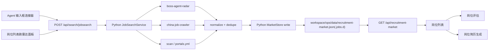

# 找岗位连接器与岗位雷达架构设计

更新时间：2026-06-09

## 目标

在 Agent 输入框左侧的连接器区域增加“找岗位”连接器，把它和岗位列表页的“跑雷达”能力连接起来。用户可以从任意对话入口触发岗位搜索，结果统一进入岗位雷达数据层，再由岗位列表、简历生成、岗位评估和投递进度复用。

这个连接器只负责发现、导入、去重和入库，不负责自动投递、自动打招呼、发送简历或交换联系方式。

## 当前基线

- 前端 Agent 输入框已经有连接器入口：`apps/web/src/sections/agent/MobileConnectorBar.tsx`，现在只展示 QQ 邮箱。
- 后端连接器边界已经在 Python daemon 中落地：`apps/py-daemon/src/ucareer_py_daemon/connectors.py` 和 `apps/py-daemon/src/ucareer_py_daemon/main.py`。
- Python routing 已有 `job.scan`，并通过 `jobsearch.search_jobs` / `jobsearch.import_current_job` tool 绑定到 Agent 执行。
- 岗位列表读取 `GET /api/recruitment-market`，数据来自 `workspace/ops/data/recruitment-market.json` 和分片目录。
- 中国岗位雷达已有两个本地脚本：
  - `scripts/research/boss-agent-radar.mjs`
  - `scripts/research/china-job-crawler.mjs`

## 产品入口

### Agent 输入框连接器

把当前 `MobileConnectorBar` 泛化为 `AgentConnectorBar`，展示多个连接器：

| 连接器 | 图标语义 | 主动作 |
|---|---|---|
| QQ 邮箱 | 邮件 | 搜索最近招聘邮件 |
| 找岗位 | 雷达/搜索 | 打开找岗位菜单 |

找岗位菜单提供这些动作：

- `跑岗位雷达`：用默认画像和关键词启动一次搜索。
- `按条件搜索`：展开城市、关键词、来源、最大新增、只读详情抓取等参数。
- `查看岗位列表`：跳转到 `market` view。
- `连接器设置`：配置来源优先级和关键词组，后续落到 `workspace/profile/portals.yml` 或 profile 的 radar 配置。

### 岗位列表页

`MarketSection` 里现有的“跑雷达”面板保留，但不直接调用脚本。它应该调用同一组后端 API，这样 Agent 输入框和岗位列表页不会出现两套扫描逻辑。

## 后端 API

新增连接器定义：

```python
{
  "id": "jobsearch",
  "label": "jobsearch",
  "kind": "job_board",
  "status": "available",
  "capabilities": ["import_jobs"],
  "readScopes": ["workspace.read"],
  "writeScopes": ["workspace.write"],
  "workspacePaths": [
    "workspace/ops/data/recruitment-market.json",
    "workspace/profile/portals.yml"
  ],
  "requiresAuth": False,
  "syncable": False
}
```

`ConnectorProtocol` 当前只有 `imap`。不要为了 `jobsearch` 伪造 protocol；它是本地执行型连接器，短期不需要 protocol 字段。后续如果把 Boss、智联、猎聘拆成独立外部连接器，再扩展 protocol union。

新增 API：

| Endpoint | 作用 |
|---|---|
| `GET /api/search/jobsearch/sources` | 返回可用来源：Boss Agent、中国平台爬虫、官网扫描、portals.yml |
| `POST /api/search/jobsearch` | 创建一次岗位搜索任务，返回 task/run id |
| `GET /api/search/jobsearch/runs/:runId` | 查询搜索状态、日志、统计和新增岗位 |
| `POST /api/search/jobsearch/import` | 手工导入 URL/JD 文本，统一写入 market store |

`search` 请求体建议：

```python
JobSearchRequest = {
  "source": "codex-chrome | boss-agent | china-crawler | portals | all",
  "city": "深圳",
  "queries": ["机器人系统工程师", "ROS2 机器人"],
  "max": 12,
  "minMatchScore": 0,
  "withDetails": True,
  "dryRun": False,
}
```

响应体建议：

```python
JobSearchResult = {
  "runId": "jobsearch_...",
  "status": "completed | failed",
  "added": 0,
  "candidatesSeen": 0,
  "duplicatesSkipped": 0,
  "jobs": [],
  "marketUpdatedAt": "2026-07-03",
}
```

### API 行为细节

`POST /api/search/jobsearch` 第一版建议同步等待脚本结束，避免过早引入第二套 run store。接口仍然返回 `runId`，但 `status` 多数情况下会直接是 `completed` 或 `failed`。如果后续发现一次扫描超过 20-30 秒，再把 service 改成后台 run。

请求默认值：

| 字段 | 默认值 | 说明 |
|---|---|---|
| `source` | `boss-agent` | 优先走已跑通的本地 Boss CLI |
| `city` | `深圳` | 与现有雷达脚本默认一致 |
| `queries` | profile/脚本默认关键词 | 用户不填时使用既有方向 |
| `max` | `25` | 避免一次导入太多低质量岗位 |
| `minMatchScore` | `0` | 第一版只导入，不在 API 层裁剪 |
| `withDetails` | `false` | 详情页抓取更慢，显式开启 |
| `dryRun` | `false` | UI 触发默认写入岗位库 |

错误码：

| code | 场景 | 前端展示 |
|---|---|---|
| `jobsearch_source_unavailable` | 选中的来源不可用，例如未安装 `boss` CLI | 提示用户去设置或换来源 |
| `jobsearch_search_failed` | 脚本非 0 退出或输出无法解析 | 展示 stderr 摘要和建议 |
| `jobsearch_permission_denied` | 没有 workspace 写权限 | 提示登录/权限 |
| `jobsearch_timeout` | 超过执行上限 | 提示缩小关键词或 max |
| `jobsearch_platform_blocked` | 登录、验证码、平台风控 | 明确说明不会绕过，需要人工处理 |

## 执行层

不要让 route 直接 `spawn` 研究脚本。当前执行入口是 Python service：

```text
apps/py-daemon/src/ucareer_py_daemon/jobsearch.py
```

职责：

- 校验请求参数和权限。
- 把 source 映射到受控命令。
- 调用现有本地脚本或未来的纯 Python connector。
- 解析 JSON 输出。
- 通过 market store 写入岗位。
- 返回结构化统计和新增岗位。

短期可以复用：

- `boss-agent` -> `node scripts/research/boss-agent-radar.mjs --max ... --city ... --query ...`
- `china-crawler` -> `node scripts/research/china-job-crawler.mjs --max=... --platform=...`

中期把脚本内的 normalize、dedupe、write market 逻辑迁到 Python daemon service，脚本只保留 CLI 包装。

### Service 接口

```python
class JobSearchService:
    def list_sources(self) -> list[dict]: ...
    def search(self, payload: dict) -> dict: ...
    def import_current_job(self, payload: dict | None = None) -> dict: ...
```

service 构造函数：

```python
JobSearchService(workspace_root=workspace_root, chrome_bridge=chrome_bridge)
```

`commandRunner` 使用受控命令白名单，不接收任意 shell 字符串：

```python
provider["id"] in {"codex-chrome", "boss-agent", "china-crawler", "portals"}
subprocess.run([node_bin, script_path, *args], shell=False, ...)
```

这样可以复用现有脚本，又避免把前端参数拼进 shell。

### Market Store 写接口

当前 Python `MarketStore` 已有读取、导入、更新和删除接口：

```python
MarketStore.get_recruitment_market()
MarketStore.import_job(payload)
MarketStore.update_job(job_id, patch)
MarketStore.delete_job(job_id)
```

`MarketStore` 负责：

- 读取现有 market。
- 用 `company + role + normalized url` 去重。
- 给新增岗位补 `id`。
- 更新 `updatedAt`、`jobsCount`、`lastJobSearchRun`。
- 写回 `recruitment-market.json` 和 `.jobs.d` 分片。

## 数据流



## Agent Tool 绑定

给 `job.scan` 增加 connector tool：

```python
connectorTools: [
  {
    "id": "jobsearch.search_jobs",
    "connectorId": "jobsearch",
    "label": "搜索岗位雷达",
    "capability": "import_jobs",
    "readonly": False,
    "risk": "medium",
    "description": "按关键词、城市和来源只读搜索岗位，并把去重后的结果写入岗位雷达。",
    "inputSchema": JobSearchRequest,
  }
]
```

这样用户在 Agent 输入框输入“帮我找今天最值得推进的岗位”时，可以由 Python `routing.py` 路由到 `job.scan`，并把 jobsearch tool 暴露给执行 Agent。

### Intake 路由

Python `routing.py` 已经会用 `搜索`、`找岗位`、`岗位搜索`、`扫描`、`jobsearch`、`radar`、`跑雷达`、`Boss`、`智联`、`猎聘` 路由到 `job.scan`。

这样输入框提示词和连接器按钮都能落到同一个 skill。

## 权限与安全

- 搜索和详情抓取是 `medium` 风险，因为会访问外部招聘平台并写入本地岗位库。
- 所有动作必须是只读采集，不允许投递、打招呼、发送简历、加微信、点赞、评论。
- 需要保留“新增、重复、失败、来源、查询词、运行时间”的审计字段。
- 写入只允许进入 `workspace/ops/data/recruitment-market.json` 和分片目录。
- 如果平台需要登录态或验证码，返回可解释错误，不绕过限制。

## 前端状态模型

`AgentConnectorBar` 只维护菜单状态，不持有业务执行状态。业务状态放到 hook：

```text
apps/web/src/hooks/useJobSearch.ts
```

hook 提供：

- `sources`
- `activeRun`
- `jobSearch(input)`
- `refreshRun(runId)`
- `lastResult`
- `error`

完成后调用 `getRecruitmentMarket()` 刷新岗位列表。这样 Agent 首页和 Market 页都能复用同一 hook。

### 前端组件结构

建议把当前 `MobileConnectorBar` 改名并拆分：

```text
apps/web/src/sections/agent/AgentConnectorBar.tsx
apps/web/src/sections/agent/connector-menu.css
apps/web/src/hooks/useJobSearch.ts
```

`AgentConnectorBar` props：

```ts
interface AgentConnectorBarProps {
  mailboxConnectionState: "connected" | "disconnected" | "unknown";
  jobSearchState: "idle" | "running" | "failed";
  onImportMessages(): void | Promise<void>;
  onJobSearch(input?: Partial<JobSearchRequest>): void | Promise<void>;
}
```

UI 行为：

- 顶层工具仍然放在输入框左侧，和 `+` 附件按钮并列。
- QQ 邮箱保留现有下拉菜单。
- `jobsearch` 使用独立快捷按钮，默认跑 `boss-agent + 深圳 + max 25`。
- 高级条件搜索放在岗位列表页，避免输入框工具条过载。
- 扫描运行中禁用重复点击，并显示短文案：`搜索中`。
- 扫描完成后通过按钮 `title` 和 Market 页结果区展示新增/重复统计。

### Market 页接入

`MarketSection` 现有“跑雷达”面板不要再只做静态表单。建议新增 props：

```ts
interface MarketSectionProps {
  market: RecruitmentMarket | null;
  jobSearch: {
    status: "idle" | "running" | "failed";
    lastResult: JobSearchResult | null;
    error: string;
    onSearch(input: JobSearchRequest): void;
  };
}
```

`ViewRenderer` 负责把 hook 动作传入 `MarketSection`。这样 Market 页按钮和 Agent 连接器按钮共享同一套执行状态。

### 前端数据刷新

`useJobSearch.jobSearch()` 成功后应调用父级传入的 `onMarketChanged()`，由 `useUcareerData.refreshMarket()` 只刷新岗位数据，而不是全量刷新所有 profile/resume/report/application。

建议在 `useUcareerData` 增加：

```ts
async function refreshMarket() {
  setMarket(await getRecruitmentMarket());
}
```

## 分阶段落地

### Phase 1：最小闭环

1. 泛化 `MobileConnectorBar` 为多连接器菜单。
2. `jobsearch` registry 定义在 Python `connectors.py` 中维护。
3. `POST /api/search/jobsearch` 由 Python FastAPI 提供。
4. service 内部先调用现有两个脚本。
5. Market 页“开始扫描”和 Agent 连接器调用同一 API。

### Phase 2：结构化执行

1. 把脚本里的 normalize/dedupe/renumber/markdown 输出迁入 Python daemon。
2. market store 增加写接口，替代脚本直接写文件。
3. job.scan skill 绑定 `jobsearch.search_jobs` connector tool。
4. Agent 执行过程中显示 run 状态和新增岗位摘要。

### Phase 3：配置化和自动化

1. 来源、城市、关键词组从 `workspace/profile/portals.yml` 或 profile radar 配置读取。
2. 支持定时扫描，但只写入候选岗位，不自动投递。
3. 支持按命中质量给岗位列表排序，并生成“今天最值得推进的 3 个岗位”摘要。

## 建议的文件改动

```text
packages/shared/src/index.ts
apps/py-daemon/src/ucareer_py_daemon/connectors.py
apps/py-daemon/src/ucareer_py_daemon/main.py
apps/py-daemon/src/ucareer_py_daemon/jobsearch.py
apps/py-daemon/src/ucareer_py_daemon/workspace_stores.py
apps/py-daemon/src/ucareer_py_daemon/routing.py
apps/web/src/api.ts
apps/web/src/hooks/useJobSearch.ts
apps/web/src/sections/agent/AgentConnectorBar.tsx
apps/web/src/sections/agent/mobile-connector.css
apps/web/src/sections/MarketSection.tsx
```

## Phase 1 具体任务拆分

### 后端

1. `packages/shared/src/index.ts`
   - 增加 `JobSearchSource`、`JobSearchRequest`、`JobSearchResult`、`ImportJobRequest`、`ImportJobResult` 类型。
   - 如果 `ConnectorProtocol` 暂不扩展，`ConnectorDefinition.protocol` 保持可选即可。

2. `apps/py-daemon/src/ucareer_py_daemon/connectors.py`
   - 维护 `jobsearch` connector。

3. `apps/py-daemon/src/ucareer_py_daemon/jobsearch.py`
   - 实现 `list_sources()`、`search()` 和 `import_current_job()`。
   - `search()` 用 `subprocess.run([...], shell=False)` 调现有 `.mjs`，不要走 shell。
   - 解析 stdout JSON，映射成 `JobSearchResult`。

4. `apps/py-daemon/src/ucareer_py_daemon/main.py`
   - 由 `create_app()` 组合 `JobSearchService` 和 FastAPI routes。

5. `apps/py-daemon/src/ucareer_py_daemon/main.py`
   - 增加 `/api/search/jobsearch/sources`。
   - 增加 `/api/search/jobsearch`。
   - 权限用 `workspace.write`，如果前端当前 session 没有该权限，再临时降到现有可用权限并记录 TODO。

### 前端

1. `apps/web/src/api.ts`
   - 增加 `getJobSearchSources()` 和 `jobSearch()`。

2. `apps/web/src/hooks/useJobSearch.ts`
   - 管理运行状态、错误、结果。
   - 成功后调用 `refreshMarket()`。

3. `apps/web/src/sections/agent/AgentConnectorBar.tsx`
   - 组合现有 `MobileConnectorBar` 邮箱入口。
   - 增加独立 `jobsearch` 快捷按钮。

4. `apps/web/src/sections/AgentSection.tsx`
   - 接收 `onJobSearch`。
   - 将连接器 bar 放回原位置。

5. `apps/web/src/sections/MarketSection.tsx`
   - “开始扫描”按钮调用 `jobSearch.onSearch()`。
   - 展示最近结果和错误。

6. `apps/web/src/layout/ViewRenderer.tsx`
   - 把 jobSearch props 传给 Agent 和 Market。

## 验收标准

- 在 Agent 输入框左侧能看到邮箱和找岗位两个连接器入口。
- 点击“跑岗位雷达”后，前端出现运行状态，不会重复触发。
- 后端调用现有本地脚本，成功后返回新增数量、重复数量和新增岗位列表。
- 岗位列表刷新后能看到新增岗位。
- 如果 `boss` CLI 不可用，前端显示明确错误，不崩溃。
- 不产生任何投递、打招呼、发送简历或平台互动动作。
- `npm run typecheck` 或项目等价类型检查通过。

## 关键设计判断

- 连接器是数据入口，不是 Agent provider，也不是权限模式的一部分。
- “找岗位”入口可以放在 Agent 输入框旁，但执行必须走 daemon API，避免前端直接调用脚本。
- 岗位雷达和 Market 页必须共享一个写入路径，避免岗位列表、评估、简历生成看到不同数据。
- 不自动投递是硬边界，所有投递动作仍然由用户手动确认。
