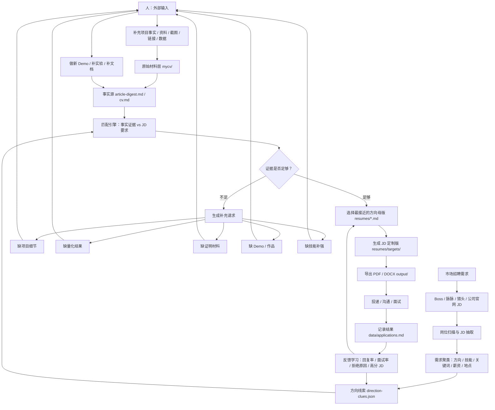

# 简历更新与维护架构

目标：让简历长期可维护。所有方向都使用同一套真实经历，但根据 JD 调整叙事、排序、关键词和证据权重。

## 1. 分层设计

### Layer 0：原始材料层

位置：

- `mycv/`

用途：

- 存放原始 Word 简历、项目经历导出、岗位修改提示词、历史版本。
- 只作为输入材料，不直接投递。
- 不要求格式统一，但文件名要表达来源和用途。

例子：

- `韦东波_简历.docx`
- `韦东波_机器人系统工程师_优化排版完整版.docx`
- `韦东波_项目经历记忆导出_用于Codex岗位匹配.md`
- `韦东波_投递具身智能数据基建工程师_Codex简历修改提示词.md`

### Layer 1：事实源层

位置：

- `cv.md`
- `article-digest.md`
- `config/profile.yml`
- `modes/_profile.md`

用途：

- `cv.md`：主简历，保持通用、真实、不过度偏向某一个岗位。
- `article-digest.md`：项目证据库，存放完整项目事实、可迁移叙事、面试故事。
- `config/profile.yml`：结构化个人信息、目标岗位、薪资、定位。
- `modes/_profile.md`：career-ops 评估岗位时使用的个性化评分规则和叙事偏好。

维护原则：

- 新事实先进入 `article-digest.md`。
- 通用且高价值的事实再同步到 `cv.md`。
- 影响岗位评分的偏好同步到 `modes/_profile.md`。
- 结构化字段同步到 `config/profile.yml`。

### Layer 2：方向化简历层

位置：

- `resumes/*.md`
- `resumes/direction-clues.json`

用途：

- 每个方向维护一份长期优化的 Markdown 简历。
- 这些不是最终投递版，而是“方向母版”。
- `direction-clues.json` 维护每个方向的 JD 信号、关键词、项目排序、强化表达、禁止夸大的内容、证据和短板。

当前方向：

- `01-robotics-system-engineer.md`
- `02-robotics-software-sdk-engineer.md`
- `03-embodied-ai-application-engineer.md`
- `04-embodied-data-infra-engineer.md`
- `05-ai-robotics-solution-engineer.md`
- `06-enterprise-ai-rag-engineer.md`

维护原则：

- 不同方向可以改变项目顺序、摘要、关键词和表达。
- 不同方向不能改变事实本身。
- 没做过的技术只能写在“正在补强”，不能写进项目成果。
- 新 JD 里反复出现的线索先进入 `direction-clues.json`，再决定是否反向更新方向母版。

### Layer 3：JD 定制层

建议位置：

- `resumes/targets/`

用途：

- 针对某个具体公司和岗位生成投递版简历。
- 由方向母版复制而来，再按 JD 精修。

命名规范：

```text
target-{company}-{role}-{YYYY-MM-DD}.md
```

例子：

```text
target-tencent-embodied-data-infra-2026-05-31.md
target-yuanzhuo-robotics-software-2026-05-31.md
```

维护原则：

- 投递版可以高度贴 JD。
- 投递版不要反向污染方向母版，除非发现了新的通用表达。

### Layer 4：输出层

位置：

- `output/`

用途：

- 存放最终 PDF、HTML、DOCX 或其他投递文件。
- 输出文件是产物，不作为事实源。

命名规范：

```text
{company}-{role}-{YYYY-MM-DD}.pdf
```

## 2. 更新流程

### 场景 A：新增项目经历

流程：

1. 原始材料放入 `mycv/`。
2. 提炼事实进入 `article-digest.md`。
3. 判断是否同步到 `cv.md`。
4. 更新相关方向简历。
5. 如果影响岗位评分，更新 `modes/_profile.md`。

### 场景 B：新增目标方向

流程：

1. 在 `research/` 建立方向研究笔记。
2. 在 `modes/_profile.md` 增加方向画像和评分规则。
3. 在 `config/profile.yml` 增加目标岗位。
4. 在 `resumes/` 新建方向母版。
5. 在 `resumes/README.md` 登记。

### 场景 C：看到一个具体 JD

流程：

1. 保存 JD 或评估报告到 `reports/`。
2. 判断最接近的方向母版。
3. 复制方向母版到 `resumes/targets/target-{company}-{role}-{date}.md`。
4. 按 JD 调整：
   - 摘要第一段
   - 核心技能排序
   - 项目顺序
   - bullet 关键词
   - 风险短板说明
5. 生成 PDF 到 `output/`。
6. 在 `data/applications.md` 记录投递版本。

### 场景 D：发现一个短板

流程：

1. 写入 `research/{direction}.md` 的短板清单。
2. 如果短板影响多个方向，写入 `article-digest.md` 的“正在补强”。
3. 不要写进项目成果。
4. 如果做了 Demo，再把 Demo 作为新项目写入事实源。

## 3. 文件职责

| 文件 | 职责 | 是否可投递 |
|---|---|---|
| `mycv/*` | 原始材料 | 否 |
| `cv.md` | 通用主简历 | 可作为基础版 |
| `article-digest.md` | 项目证据库 | 否 |
| `config/profile.yml` | 结构化画像 | 否 |
| `modes/_profile.md` | 岗位评估规则 | 否 |
| `research/*.md` | 方向研究和短板 | 否 |
| `resumes/*.md` | 方向母版 | 可改后投递 |
| `resumes/targets/*.md` | JD 定制版 | 是 |
| `output/*` | 最终导出文件 | 是 |
| `reports/*` | 岗位评估报告 | 否 |
| `data/applications.md` | 申请记录 | 否 |

## 4. 推荐目录结构

```text
career-ops/
  mycv/                 # 原始材料
    project-notes/      # 人类补充的项目事实卡片
  cv.md                 # 通用主简历
  article-digest.md     # 项目证据库
  config/profile.yml    # 结构化个人画像
  modes/_profile.md     # 岗位评分与叙事规则
  research/             # 方向研究、JD 信号、短板清单
  resumes/
    README.md
    ARCHITECTURE.md
    direction-clues.json
    01-robotics-system-engineer.md
    02-robotics-software-sdk-engineer.md
    03-embodied-ai-application-engineer.md
    04-embodied-data-infra-engineer.md
    05-ai-robotics-solution-engineer.md
    06-enterprise-ai-rag-engineer.md
    targets/            # 具体 JD 定制版
  reports/              # 岗位评估
  output/               # PDF / HTML / DOCX 输出
  data/applications.md  # tracker
  data/evidence-requests.json # 系统生成的证据补充请求
```

## 5. 内容治理规则

### 单一事实源

事实只从 `article-digest.md` 和 `cv.md` 进入方向简历。不要直接从记忆改方向简历。

### 事实与包装分离

- 事实：做过什么、用了什么技术、有什么结果。
- 包装：这个事实在不同岗位里怎么讲。

例子：

- 事实：做过 RAG / Agent 售后知识系统。
- 机器人系统包装：客户问题闭环和工程知识沉淀。
- 数据基建包装：多源工程数据治理、质量评估、失败样本回流。
- 解决方案包装：售前售后业务闭环和客户成功。

### 不伪造短板

以下内容没有项目支撑时，不写成已完成经验：

- Spark / Flink / Hive 大规模生产经验
- 视觉模型训练论文或检测分割算法研究
- 强化学习 / 模仿学习生产训练经验
- 大规模机器人训练数据平台生产经验

可以写：

- 正在补强
- 有相关理解
- 有可迁移经验
- 已规划 Demo

## 6. 每次更新检查清单

更新后检查：

- `npm run doctor`
- `rg -n "新增关键词" cv.md article-digest.md resumes modes/_profile.md config/profile.yml`
- 确认方向简历没有互相矛盾。
- 确认投递版没有夸大未做过的技术。
- 确认 `data/applications.md` 记录了使用的简历版本。

## 7. 后续建议

优先补三个资产：

1. `resumes/targets/`：保存每个 JD 的最终简历。
2. `output/`：每个投递版导出 PDF。
3. Demo 项目：围绕“机器人多模态数据集构建 Pipeline”补一个可展示项目，用来支撑具身智能数据基建方向。

## 8. 市场驱动的持续闭环

目标：让系统持续读取市场需求，用真实经历去匹配岗位；当证据不足时，不伪造，而是向人发出补充请求。



### 闭环角色

| 模块 | 作用 | 产物 |
|---|---|---|
| 市场扫描 | 从 Boss、脉脉、猎头、官网收集 JD | `reports/*.md`、`research/*.md` |
| 需求聚类 | 找反复出现的关键词和能力要求 | `resumes/direction-clues.json` |
| 匹配引擎 | 判断现有经历能不能支撑这个岗位 | 岗位评分、缺口清单 |
| 人类输入 | 补充真实项目材料和证明 | `mycv/project-notes/*.md` |
| 事实源 | 保存可复用、可证明的真实经历 | `article-digest.md`、`cv.md` |
| 方向母版 | 面向长期方向维护简历 | `resumes/*.md` |
| JD 定制 | 针对具体岗位生成投递版 | `resumes/targets/*.md` |
| 投递反馈 | 用回复率和面试率反向优化 | `data/applications.md` |
| 证据请求 | 市场需求和简历事实之间的缺口 | `data/evidence-requests.json` |

### 补充请求格式

当系统发现简历证据不足时，不直接改写成“已掌握”，而是向人发请求：

```text
缺口：JD 要求机器人多模态数据集构建 / ROS bag / 数据质检。
当前证据：有 RAG 数据治理和机器人通信日志理解，但缺少机器人数据集 Pipeline Demo。
请补充：
1. 是否做过 ROS bag / MCAP / 图像 / 轨迹 / 状态日志处理？
2. 有没有截图、代码、测试记录或文档？
3. 如果没有，是否可以做一个 1-2 天 Demo 来补足？
```

### 优先请求人补充的信息

1. 项目背景：为什么做，解决谁的问题。
2. 你的角色：负责人、核心开发、参与者、协同推进。
3. 技术栈：协议、框架、模型、数据库、部署、工具。
4. 输入数据：文档、日志、图片、表格、客户问题、测试集。
5. 关键动作：设计、开发、调试、部署、评测、复现、闭环。
6. 难点：最难的问题是什么，怎么拆。
7. 量化结果：准确率、召回率、下载量、客户数、节省时间、咨询减少比例。
8. 证明材料：GitHub、截图、文档、报告、视频、issue、测试记录。
9. 可公开程度：哪些能写进简历，哪些只能面试口述。
